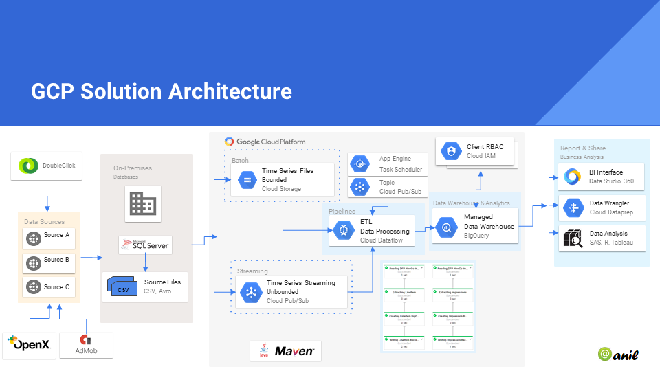

# dfpnewco
 

GCP Dataflow Implementation to ingest DoubleClick time series data into BigQuery. This implementation
demonstrates and highlights the use of Dataflow as a better alternative to Lambda architecture.

## Setup

You will need the following :::

+ GCP credentails
+ Dataflow SDK 1.x for Java
+ JDK
+ Maven (```brew install maven```, ```sudo apt-get install maven```, GCP Ubuntu)
+ SLF4J

----



----

## Run the dfpnewco application

After you've made the necessary changes, do a clean build:

```
mvn clean package
```

Then run the main Dataflow pipeline to load data into BigQuery:

```
mvn -Pgcp exec:exec -Dexec.mainClass="com.newco.dataflow.pipeline.LineItemTransformPipeline"
```
